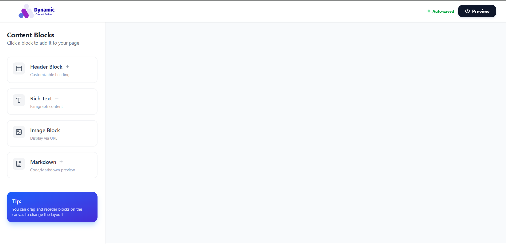
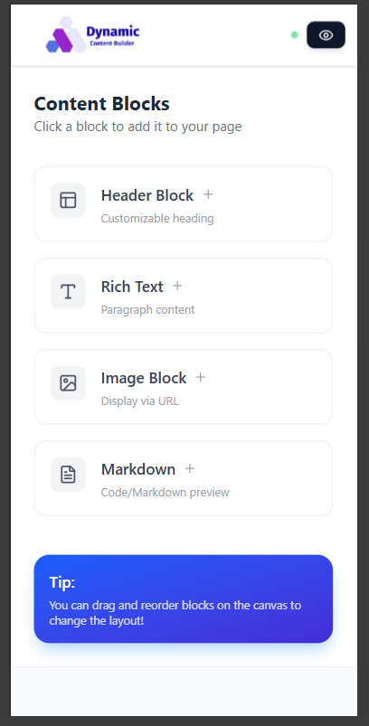
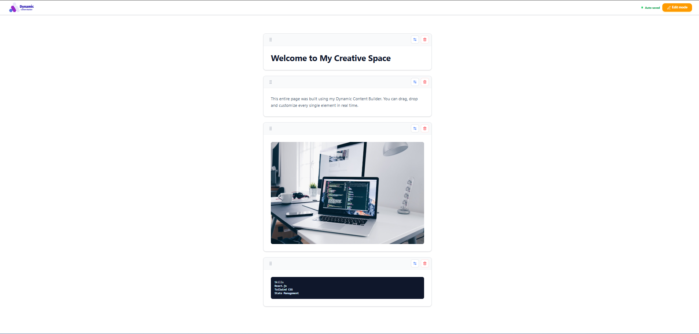

# 🚀 Dynamic Content Builder

A professional, interactive web application built with **React.js** and **Tailwind CSS** that allows users to dynamically build and customize personal content pages using draggable and configurable components.

---

## 🔗 Project Links
- **Live Deployment:** https://dynamic-content-builder-ivory.vercel.app/
- **Video Demonstration:** https://drive.google.com/file/d/10NDDI8kVQF-QVpSsdAOI8Ifd4_wZIQRW/view?usp=drivesdk
- **GitHub Repository:** 

---

## ✨ Key Features
- **Interactive Palette:** Drag and drop or click to add predefined content blocks (Header, Rich Text, Image, Markdown).
- **Dynamic Configuration:** Real-time editing of every block (e.g., setting header levels H1-H6, updating image URLs).
- **Drag & Drop Reordering:** Smooth vertical reordering of blocks using `@dnd-kit`.
- **Persistence:** Local Storage integration ensures your page state persists across browser sessions.
- **Preview Mode:** Toggle between 'Edit' and 'Preview' mode to see the final look of the page.
- **Fully Responsive:** Optimized UI for Mobile, Tablet, and Desktop with a sticky adaptive navbar.

## 📸 Screenshots

### Desktop View


### Mobile & Tablet Responsiveness


### Editing & Customization


---

## 🎨 Creative UI/UX Choices
- **Minimalist Aesthetic:** Clean white interface with subtle shadows and rounded corners (`rounded-xl`) to focus on content.
- **Intuitive Feedback:** Visual cues like an animated "Auto-saved" indicator and subtle hover animations on the logo and blocks.
- **Adaptive Navbar:** On mobile, text labels are hidden in favor of icons and a compact status dot to prevent layout overcrowding.
- **Direct Interaction:** Added double-click to edit functionality for a faster building experience.

---

## 🛠 Tech Stack
- **Framework:** React.js (Vite)
- **Styling:** Tailwind CSS (Mobile-first responsive design)
- **Drag & Drop:** `@dnd-kit` (chosen for its performance and modern API)
- **Icons:** `lucide-react` (for clean, consistent iconography)
- **Persistence:** Browser `localStorage` API

---

## 🏗 Component Architecture & Design
The project follows a modular component-based structure for maintainability:
- **Navbar:** Sticky header managing global states like Preview/Edit mode and displaying auto-save status
- **Sidebar:** The "Palette" containing block templates with instant-add functionality.
- **Canvas:** The main drop zone that manages the sorting context for all content blocks.
- **Editor:** A context-aware configuration panel for fine-tuning block-specific settings like H1-H6 levels and image URL management.
- **ContentBlock:** A versatile wrapper that handles individual block rendering and user interactions.

---

## 🧠 State Management & Persistence
- **Block Data Structure:** Each block is an object with a unique `id` (timestamp-based), a `type`, `content`, and a `settings` object (for levels/colors).
- **Handling Arrangement:** The order of blocks is maintained in a central `blocks` state array. Reordering is handled using the `arrayMove` utility from `@dnd-kit`, ensuring the UI reflects the data array accurately.
- **Persistence Strategy:** A `useEffect` hook monitors the `blocks` state. Every time a change occurs (add, update, or reorder), the entire array is serialized and saved to `localStorage`. On page load, the initial state is hydrated from this stored data.

---

## 🚀 How to Run Locally
Follow these steps to run the project locally:

1. **Clone the repository:**
   ```bash
   git clone https://github.com/Prerna-Singh-90/dynamic-content-builder.git
2. **Navigate to Directory:**
   ```Bash
   cd dynamic-content-builder
3. **Install Dependencies:**
    ```Bash
   npm install
4. **Run the Project:**
   ```Bash
   npm run dev
   
## 👩‍💻 Author
Prerna Frontend Developer
